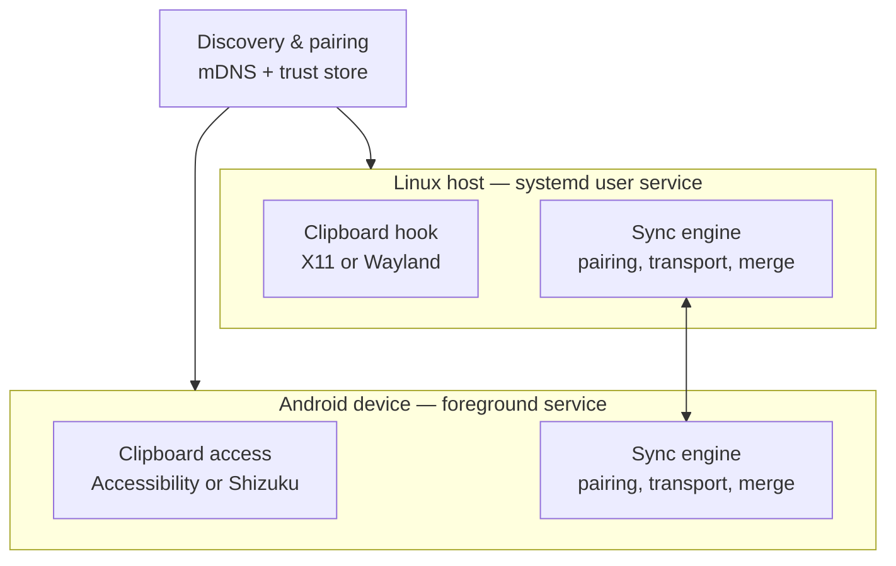

# Sync ecosystem — planning document

**Scope for v1:** clipboard sync only, across any local network two devices happen to share (home Wi-Fi, a phone's mobile hotspot, a Linux-hosted hotspot, a café AP). Target platforms: Linux and Android, with the experience feeling seamless — pair once, then it just works whenever both devices are on the same network again. Architected so future device types (files, notifications) can reuse the same sync engine.

---

## 1. Goals and non-goals

**Goals**
- Auto-discover peers whenever a paired device joins the same local network.
- Auto-sync clipboard content between paired devices with no manual trigger.
- Pair once via PIN/QR; never require re-pairing when networks change.
- Work over any local network — home router, either device's own hotspot, public/guest Wi-Fi — not a fixed network.
- Encrypt and authenticate everything; never trust a device based on network membership alone.

**Non-goals (v1)**
- Syncing when devices are *not* on a shared local network (no relay/rendezvous server yet — see Section 11).
- Syncing anything beyond clipboard (files, notifications) — architecture should allow it later, but it's not built now.
- Working around networks with client/AP isolation (hotspots or guest Wi-Fi that block device-to-device traffic) — this is undetectable-in-advance and unfixable in software; the app should detect and report it, not attempt to bypass it.

---

## 2. Architecture overview

Two symmetric components run on every device:

- **Clipboard access** — platform-specific hook into the OS clipboard (read on change, write on incoming sync).
- **Sync engine** — identical logic on both platforms: pairing state, trust store, transport, conflict resolution, loop prevention.

A shared **discovery + pairing** layer sits above both:

Keeping the sync engine identical on both platforms (same message format, same trust/conflict logic) means the only platform-specific code is the clipboard hook and the discovery API binding.

---

## 3. Discovery

Use **mDNS/DNS-SD** rather than a custom broadcast protocol:

- Linux: via Avahi (already present on most distros), advertising and browsing a service type such as `_clipsync._tcp`.
- Android: via `NsdManager` (Network Service Discovery), same service type.

Both speak the same wire protocol, so any paired device on the same broadcast/multicast domain is visible automatically — no polling required. This is what makes "auto-sync when a new device comes online" work without extra plumbing.

**Discovery must be re-triggered on every network change**, not run once at startup:

- Linux: hook interface up/down via `networkd-dispatcher` or NetworkManager dispatcher scripts (or listen on a netlink socket), and restart the Avahi announce/browse on each change.
- Android: register a `ConnectivityManager.NetworkCallback` for Wi-Fi network changes — this fires both for "joined the home router" and "connected to a hotspot" — and re-trigger `NsdManager` discovery each time.

---

## 4. Pairing and trust model

Discovery tells you a device *exists* on the network. It says nothing about whether it should be trusted — anything on a shared/guest network could otherwise silently receive or inject clipboard content. Pairing is the step that establishes trust, and it must never be skipped.

**Trust must be network-independent.** Never bind "trusted" to an IP address, MAC, or the network the pairing happened on — a phone's IP on the home router, on its own hotspot, and on a laptop-hosted hotspot are three different addresses on three different subnets, none of them stable. What's stable is a cryptographic identity:

1. Each device generates (or already has) a long-lived keypair.
2. During the PIN/QR pairing step, the two devices exchange public keys / certificate fingerprints, authenticated by the shared PIN (or QR-encoded secret) so a third party on the network can't inject their own key during the exchange.
3. Each device stores the peer's fingerprint plus a human label ("Keres' Pixel", "Keres' ThinkPad") in a local trust store.
4. From then on, "is this peer trusted" is answered purely by "does the certificate it presents during the TLS handshake match a stored fingerprint" — independent of network, IP, or hostname.

**Never auto-prompt for an unknown device.** An unpaired device that's discovered just appears as "unpaired" in the UI; the PIN/QR flow only starts when the user explicitly initiates pairing with it. Auto-prompting on discovery would be a social-engineering vector on shared networks.

---

## 5. Auto-connect flow

1. Device joins any network (Wi-Fi association completes, hotspot connects, etc.).
2. The sync agent detects the network change (Section 3) and re-registers/re-browses mDNS on the new interface.
3. If another advertising device is seen, attempt a TLS handshake.
4. If the peer's certificate fingerprint matches a stored trust entry → connect silently, no prompt, resume syncing.
5. If it doesn't match anything stored → treat as unpaired; only show pairing UI if the user initiates it.

---

## 6. Transport and encryption

- **Mutual TLS**, not one-way — both sides present and verify a certificate, since there's no CA for a LAN device; verification uses the pinned fingerprint from pairing rather than a certificate chain.
- Persistent connection (WebSocket or raw TCP wrapped in TLS) rather than HTTP polling, so pushes are instant.
- Every sync message travels inside this encrypted, mutually authenticated channel — pairing establishes identity, TLS establishes the encrypted session per connection.

**Option considered:** a local MQTT broker (e.g. mosquitto) as the sync bus instead of point-to-point sockets. Retained messages and LWT (last-will-testament) give near-free presence detection, and this fits your existing MQTT/IoT experience. Tradeoff: one more service to keep alive. Recommendation: start point-to-point for the two-device case; revisit MQTT if the ecosystem grows to many simultaneous devices.

---

## 7. Sync protocol / data model

Every clip event carries:

- `origin_device_id` — which device the content originated from.
- `sequence` — a monotonic counter (or logical clock) per device, **not** a wall-clock timestamp, since clock drift between a phone and a laptop can misorder near-simultaneous copies.
- `content_type` — text, and later image/rich-text.
- `payload` (or payload hash + size for large content).
- `sensitive` flag — mirrors Android's `EXTRA_IS_SENSITIVE`, used to exclude the clip from sync by default (see Section 9).

**Loop prevention:** when a peer receives a clip, it writes it to the local clipboard *and* remembers that the resulting local clipboard-change event originated from the network, so that event isn't rebroadcast back to its source.

**Conflict resolution:** last-write-wins ordered by `(device_id, sequence)`, not wall-clock time. Decide up front whether the "losing" clip is discarded or kept in a short local history so nothing is silently lost.

---

## 8. Platform-specific considerations

### Linux

- **X11**: clipboard-owner-change events are available cleanly via XFixes; `xclip`/`xsel`-style tooling can watch changes event-driven.
- **Wayland**: no unified clipboard protocol across compositors. wlroots-based compositors (Sway, etc.) support `wlr-data-control` for privileged background clipboard watching. GNOME and KDE don't expose the same thing to arbitrary background processes — access is portal-mediated and more restrictive by design.
- **Plan**: build against X11 first (still the common case), detect Wayland at runtime, treat wlroots compositors as full support, and fall back to manual/foreground-triggered sync on GNOME/KDE Wayland until/unless a better hook is available.
- **Two clipboard buffers**: X11 has `PRIMARY` (select-to-copy) and `CLIPBOARD` (explicit copy) as separate buffers. Sync `CLIPBOARD` only by default, or every text selection while reading will get synced.
- **Daemon**: ship as a systemd `--user` service so it starts on login and survives restarts.

### Android

- Since Android 10, only the focused app or the active IME can read the clipboard — a background service gets nothing by default.
- From Android 12 onward, every clipboard read triggers a toast notification to the user (transparency measure); the `EXTRA_IS_SENSITIVE` flag lets an app mark content so keyboard previews don't show it in clear text.
- **Background monitoring options:**
  - *Accessibility Service* — no root needed, but broad/sensitive permission (can technically read on-screen text generally); only fires on recognizable accessibility copy events, so some copies are missed.
  - *Shizuku* — one-time ADB-level privilege grant (no full root); more reliable event coverage than Accessibility, but requires a one-time adb/wireless-debugging setup from the user.
  - *Root* — most reliable, least realistic for a general-audience tool.
- Requires a **foreground service** with a persistent notification — Android won't allow a clipboard-watching process to run invisibly in the background.
- Requires walking the user through a **battery-optimization exemption**; OEM skins (MIUI, EMUI, etc.) layer their own autostart/battery kill-lists on top of stock Android and routinely break background services silently — budget real onboarding UX here, it matters more than any sync code.
- **Network binding**: Android may keep mobile data as the "default" network for app traffic even while Wi-Fi is connected, if that Wi-Fi network has no validated internet access — which is exactly what a Linux-hosted or phone-hosted hotspot looks like to Android. Fix: request the Wi-Fi transport explicitly via `ConnectivityManager.requestNetwork()` with a `NetworkRequest` specifying `TRANSPORT_WIFI`, then call `Network.bindSocket()` on the sync connection so it always routes over Wi-Fi regardless of whether mobile data is on.

---

## 9. Edge cases

| Edge case | Handling |
|---|---|
| Clip synced from A to B bounces back to A | Origin tagging + "from network" flag on the resulting local event (Section 7) |
| Sensitive content (passwords, OTPs, password-manager copies) | Excluded from sync by default via `sensitive` flag; needs an opt-out/exclusion list, not just encryption |
| Simultaneous copies on two devices | Ordered by logical clock `(device_id, sequence)`; decide whether the loser is discarded or kept in local history |
| Images / rich text / file references | No universal cross-OS clipboard representation — define a canonical wire format (text + optional inline image blob under a size cap); decide fallback for untranslatable formats (Android `content://` URIs vs. Linux file-manager path lists) |
| Large clipboard payloads | Size cap; above the cap, notify but don't sync rather than choking the connection |
| Guest Wi-Fi / VLAN separation / active VPN | mDNS visibility can silently disappear even though both devices are "on the network" from the user's view — provide a manual "add by IP" pairing fallback |
| Client/AP isolation on hotspots or guest Wi-Fi | Undetectable in advance, unfixable in software — detect via discovery timeout with zero peers seen and surface a clear message ("no paired device found — this network may block direct device connections") |
| Device sleep / temporarily offline | Decide whether clips sent while offline are queued (with a TTL) or dropped; queuing is more seamless but adds state |
| X11 `PRIMARY` vs `CLIPBOARD` | Sync `CLIPBOARD` only by default |
| Android routing over mobile data despite Wi-Fi being connected | Explicit `TRANSPORT_WIFI` request + `bindSocket()` (Section 8) |
| OEM battery/autostart killers | Real onboarding effort, not a code fix — the single biggest cause of "unreliable" background sync in practice |
| Peer removed/revoked | Either device can drop a fingerprint from its trust store unilaterally; the other side's next handshake is simply rejected — its UI should treat handshake rejection as "unpaired," not an error |

---

## 10. Layered security model

1. **Pairing layer** — PIN/QR exchange, one-time, authenticates the initial key/fingerprint exchange between the two devices.
2. **Transport layer** — mutual TLS using the pinned fingerprint from pairing (no CA chain, since there's no CA for a LAN device); both sides authenticate each other, not just the "server" side.
3. **Message layer** — every sync event carries origin device ID and sequence number inside the encrypted channel, so origin can't be spoofed or replayed even in a hypothetical transport downgrade.
4. **Content policy layer** — independent of encryption: sensitive-flagged clips are excluded from sync by default regardless of channel trust, because encryption protects data in transit, not from a wrong sync policy.
5. **Revocation** — unilateral; no two-party agreement needed to unpair. A revoked peer's future handshakes are simply rejected at the TLS layer.

---

## 11. Suggested phasing

1. **Pairing + discovery skeleton.** Text-only clipboard push, one direction at a time, manually triggered — prove the trust and transport model before automating anything.
2. **Bidirectional auto-sync** with loop prevention and logical-clock conflict resolution.
3. **Rich content support** — images/rich text with size limits.
4. **Harden the Android side** — Shizuku setup flow, battery-exemption onboarding, per-app/content sensitive-content exclusion.
5. **Generalize the sync engine** — model messages as a generic `SyncEvent{type, payload, origin, sequence}` so files or notifications can plug into the same transport later without a rebuild.
6. **(Future, optional) Off-LAN sync** — add a relay/rendezvous hop (à la Syncthing's discovery-server model) for when devices aren't sharing a local network at all. Out of scope for v1; the generic message format above makes it additive rather than a redesign.

---

## 12. Open items to decide during implementation

- Local clip history depth (how many past clips to retain per device, if any, beyond the live clipboard).
- Exact size cap for image/rich-content payloads.
- Whether GNOME/KDE Wayland gets a real background hook eventually, or stays on manual/foreground-triggered sync indefinitely.
- Whether to build the Linux daemon and Android sync engine in matching languages/frameworks for easier shared protocol maintenance, or accept divergent implementations of the same spec.
